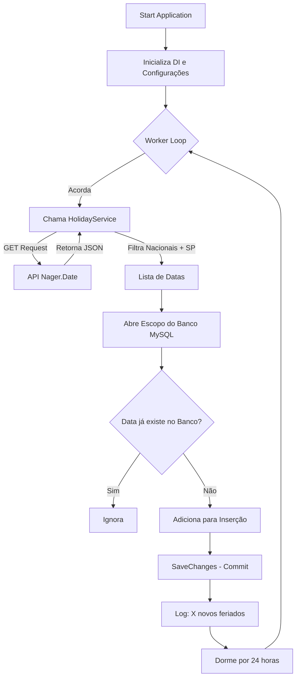

# 📅 Feriado Worker Service (.NET 10)

Este projeto é um **Worker Service** desenvolvido em **.NET 10** que executa em segundo plano para verificar e armazenar feriados Nacionais (Brasil) e Estaduais (São Paulo) em um banco de dados **MySQL**.

O serviço consulta periodicamente a API pública [Nager.Date](https://date.nager.at/) e salva novos registros no banco de dados, evitando duplicidade.

---

## 🚀 Tecnologias Utilizadas

* **Linguagem:** C# (.NET 10)
* **Tipo de Projeto:** Worker Service (Background Service)
* **Banco de Dados:** MySQL 8.0 (via Docker)
* **ORM:** Entity Framework Core (Pomelo)
* **API Externa:** Nager.Date (API Pública Gratuita)
* **Containerização:** Docker & Docker Compose

---

## 📋 Pré-requisitos

* [.NET 10 SDK](https://dotnet.microsoft.com/download) instalado
* [Docker](https://www.docker.com/) e **Docker Compose** instalados e rodando
* Cliente MySQL (MySQL Workbench, DBeaver) para rodar o script inicial

---

## 🔄 Fluxo de Execução


---

## 🛠️ Configuração e Instalação

### 1. Subir o Banco de Dados (Docker)

O projeto possui um arquivo `docker-compose.yml` configurado para rodar o MySQL 8.0.

Na raiz do projeto (`feriado-work/`), execute:
```bash
docker compose up -d
```

**Dados de Conexão do Container:**
* Host: `localhost` (ou `127.0.0.1`)
* Porta Externa: `3307` (Mapeada para 3306 interna)
* Usuário: `root`
* Senha: `sua_senha`
* Database: `feriados_db`

### 2. Criar a Tabela (Script SQL)

Como o serviço não cria a tabela automaticamente (por design), conecte-se ao banco usando seu cliente preferido (na porta 3307) e execute o script abaixo:
```sql
CREATE DATABASE IF NOT EXISTS feriados_db;
USE feriados_db;

CREATE TABLE IF NOT EXISTS feriados (
    ID INT AUTO_INCREMENT PRIMARY KEY,
    data DATE NOT NULL
);
```

### 3. Configuração da Aplicação

Verifique o arquivo `backend/appsettings.Development.json`. A string de conexão deve apontar para a porta 3307:
```json
"ConnectionStrings": {
  "DefaultConnection": "Server=localhost;Port=3307;Database=feriados_db;User=root;Password=sua_senha;"
}
```

---

## ▶️ Como Rodar

Navegue até a pasta do backend e execute o projeto:
```bash
cd backend
dotnet run
```

**O que esperar no console:**

O Worker irá iniciar, consultar a API e logar o progresso:
```
info: feriado.Worker[0]
      Verificando feriados (Nacionais e SP)... 14/02/2026 10:00:00 -03:00
info: feriado.Worker[0]
      12 novos feriados adicionados.
```

O serviço ficará em execução e verificará novamente a cada 24 horas.

---

## 📂 Estrutura do Projeto
```
feriado-work/
├── docker-compose.yml        # Configuração do MySQL em Container
├── backend/
│   ├── Data/
│   │   └── AppDbContext.cs   # Contexto do EF Core
│   ├── Models/
│   │   └── Feriado.cs        # Modelo da tabela (ID, Data)
│   ├── Services/
│   │   └── HolidayService.cs # Lógica de consumo da API Nager.Date
│   ├── Worker.cs             # Serviço em Background (Loop principal)
│   ├── Program.cs            # Injeção de dependência e Startup
│   └── appsettings.json      # Configurações de ambiente
```

---

## 🔍 Detalhes da API

O serviço consome a rota:
```
GET https://date.nager.at/api/v3/publicholidays/{YEAR}/BR
```

**Lógica de Filtragem:**

O sistema salva apenas se:
1. O feriado for Global (Nacional)
2. OU se o feriado for específico da região `BR-SP` (Estado de São Paulo)

---

## 📝 Licença

Este projeto é para fins de estudo e portfólio.